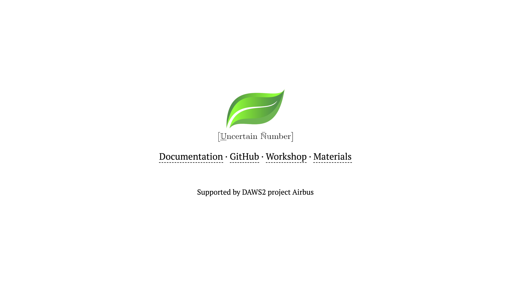

# Introduction

This repository is for the organisationof the `UQ & M workshop`for the DAWS2 project on Jan 27th 2025.

### slides

The slides can be found in the [slides directory](./slides/)

### code demonstrations

The links to the rendered notebooks can be found below:

1. [cantiliver beam example](https://nbviewer.org/github/leslieDLcy/DAWS2_UQworkshop_Dec2024/blob/main/notebooks/UP_demonstration%5BCantileverBbeam%5D.ipynb);

### The PyUncertainNumber package and documentation

- [the PyUncertainNumber package on GitHub](https://github.com/leslieDLcy/PyUncertainNumber)
- the [documentation](https://pyuncertainnumber.readthedocs.io/en/latest/index.html)

